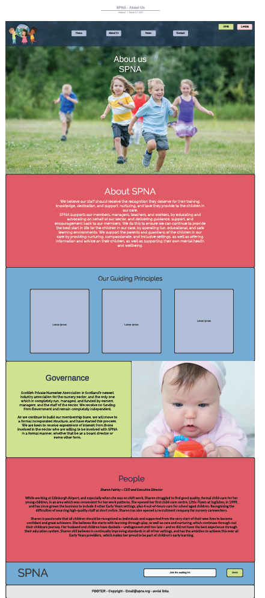
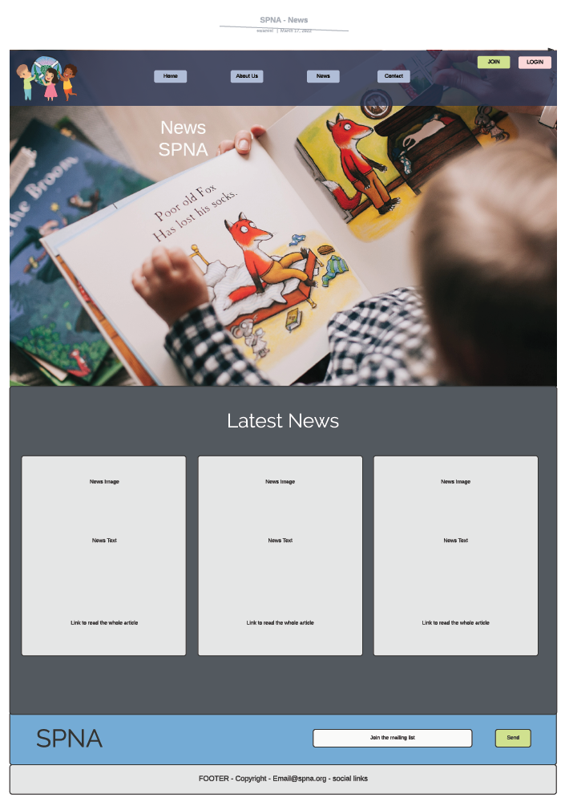
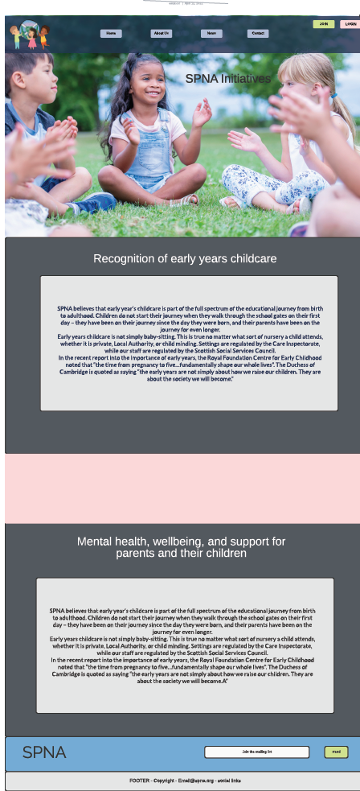
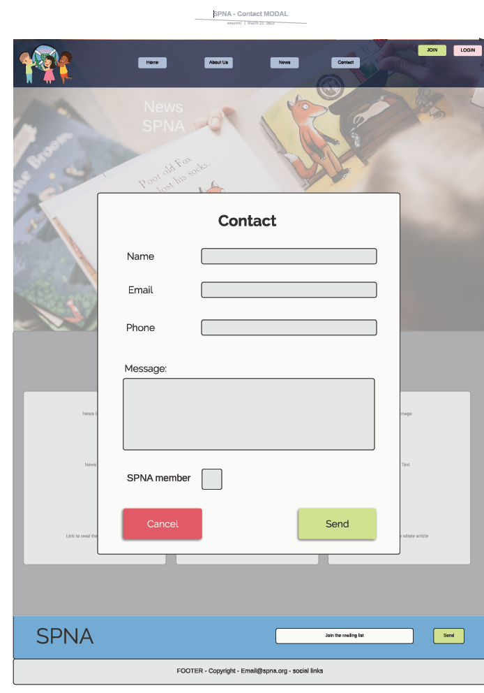
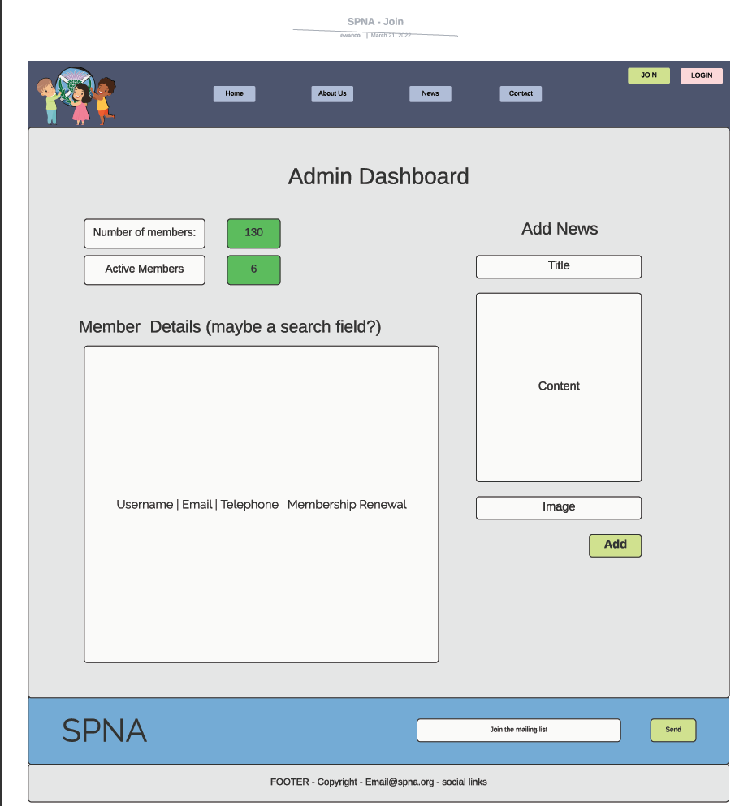
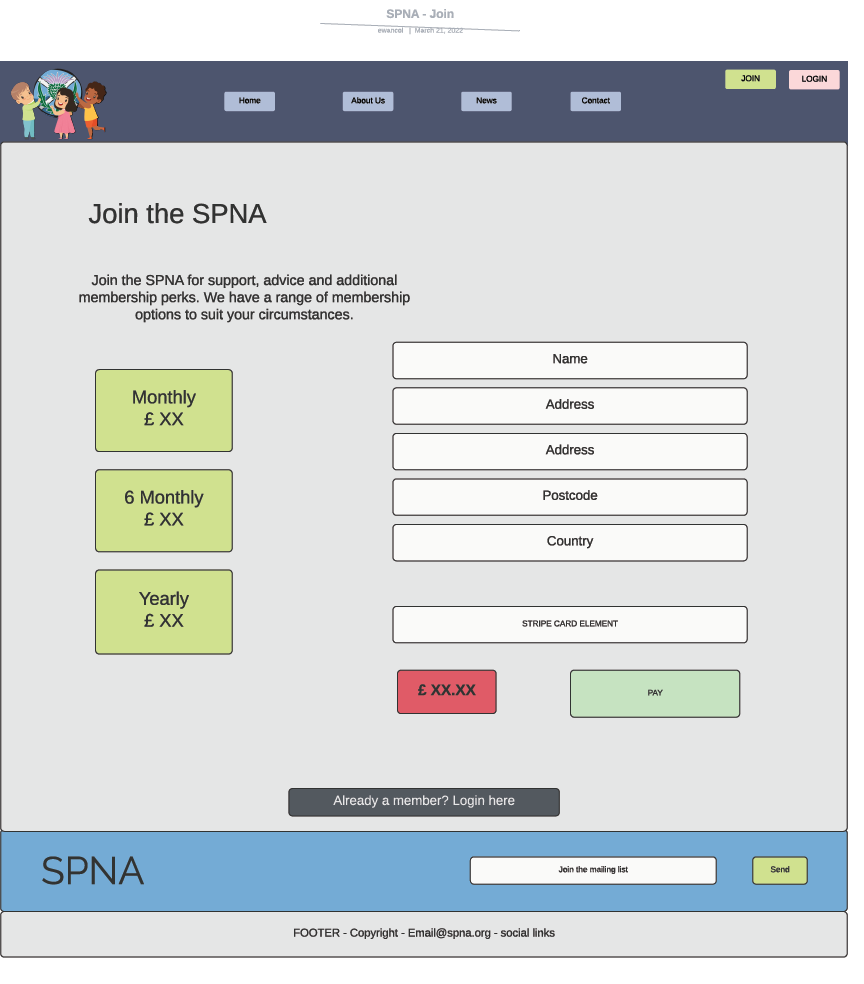
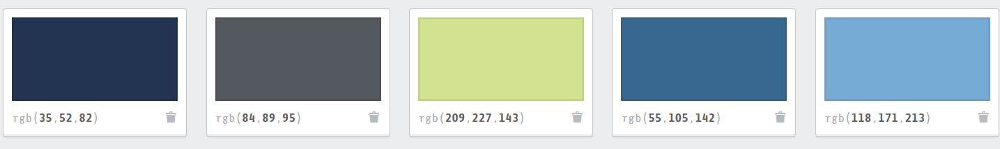
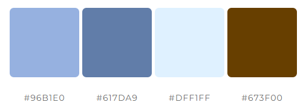

# Scottish Private Nursery Association SPNA

The Scottish Private Nursery Association is an operating association for private nurseries operating in Scotland. 
The SPNA provides a body to the Private nursery owners and staff that can rely on and to help and support when required. 
I was approached by the Client, one of the SPNA founders to see if I could make their updated website a bit more admin user friendly.

This site has been designed and created with the end user (the Client) in mind. In conjunction with the Client many new features have 
been added and some removed as the design process progressed. 

<!--  -->

<!-- The live site can be viewed [here!](https://spna.herokuapp.com/) -->

# Contents

* [**User Experience UX**](<#user-experience-ux>)
    * [User Stories](<#user-stories>)
    * [Wireframes](<#wireframes>)
    * [Site Structure](<#site-structure>)
    * [Design Choices](<#design-choices>)
        *  [Typography](<#typography>)
        *  [Colour Scheme](<#colour-scheme>)
* [**Data Model**](<#data-model>)
* [**Features**](<#features>)
    * [**Existing Features**](<#existing-features>)
        * [**Home**](<#home-page>)
            * [Navigation bar](<#navigation-bar>)
            * [Footer](<#footer>)
        * [**About Us**](<#about-us-page>)
        * [**News Page**](<#news-page>)
        * [**Initiatives and Campaigns**](<#initiatives-and-campaigns-page>)
        * [**Contact Modal**](<#contact-modal>)
        * [**Members Area**](<#members-area-page>)
        * [**SPNA Admin Page**](<#spna-admin-page>)
    * [**Future Features**](<#future-features>)
* [**Technologies Used**](<#technologies-used>)
* [**Testing**](<#testing>)
* [**Deployment**](<#deployment>)
* [**Credits**](<#credits>)
    * [**Content**](<#content>)
    * [**Media**](<#media>)
*  [**Acknowledgements**](<#acknowledgements>)

# User Experience (UX)

## User Stories

As a **USER** I want to **GOAL** so that i can **RESULT**.

* As a **USER** I want to **KNOW MORE ABOUT THE SPNA** so that I can **DETERMINE IF I WANT TO JOIN**.
* As a **USER** I want to **JOIN THE SPNA** so that I can **BENIFIT FROM MEMBER PREVILAGES**.
* As a **USER** I want to **SEE WHAT NEWS ARITCLES RELATING TO THE SPNA** so that I can **BE MORE INFORMED ABOUT THEIR ACTIVITIES**.
* As a **USER** I want to **KNOW WHAT CAMPAIGNS THE SPNA ARE INVOLVED WITH** so that I can **LEARN AND VIEW THEIR CAUSES**.
* As a **USER** I want to **KNOW WHAT INITIATIVES THE SPNA ARE RUNNING** so that I can **DO MY PART AND HELP**.
* As a **USER** I want to **CONTACT THE SPNA** so that I can **DIRECT ANY ENQUIRES APPROPRIATELY**.

* As an **ADMIN** I want to **TAKE PAYMENTS** so that I can **BUILD UP A REVENUE STREAM FROM MEMBERS**.
* As an **ADMIN** I want to **COLLECT MEMBER DETAILS** so that I can **CONTACT THEM REGARDING UPDATES AND NEWS**.
* As an **ADMIN** I want to **UPDATE THE NEWS ARTICLES** so that I can **KEEP THE WEBSITE NEWS PAGE CURRENT**.
* As an **ADMIN** I want to **UPDATE THE MEMBER DOCUMENTS** so that I can **LET THE MEMBERS KNOW THE LATEST INFORMATION**.
* As an **ADMIN** I want to **LINK TO SOCIAL MEDIA SITES** so that I can **INCREASE THE MEMBERSHIP**.

The above user stories were created in conjunction with the Client and their deveopment progress monitored in an agile environment. The project tab of github was used to help with this task. The MoSCoW method was used to define acceptance criteria for each user story. This gave some guidance as to what was going to be required at each stage of the applications development. 

[Back to top](<#contents>)

## Wireframes
 <!-- NEED TO ADD MOBILE WIREFRAMES -->

* Home page 

    

* About Us page

    

* News page

    

* Initiatives|Campaigns page

    

* Contact page

    

* Members page

    

* SPNA Admin page

    

* Sign Up page

    

[Back to top](<#contents>)

## Site Structure

## Design Choices

 * ### Typography
    - The fonts chosen for the SPNA were:
        - Title and sub title - Caveat, cursive.
        - Body is Raleway, sans-serif.
    
        These both give a relaxed and welcoming appearance to the page whilst being easily readable. 'Moon dance' was used initially as the title font but upon consultation with the client was changed to 'Caveat'.

 * ### Colour Scheme
    - The color schemes were compiled from [colorpeek](https://colorpeek.com/) based on the existing SPNA site colours with addition of some of my own from [mycolorspace](https://mycolor.space/).
    
    

 
[Back to top](<#contents>)

# Data Model
The models are as follows;
    * Custom user model (SPNAMember)
        - Builds on the Django user model but with specific nursery, SPNA and stripe details relating to payment.
    * Contact details (Contact)
        - Adds the contact details from the contact form to the database.
    * Articles (Articles)
        - Adds articles for the news page into the database.
  
<!--  -->

[Back to top](<#contents>)
# Features

## Existing Features

### Home Page
* Contains some basic introductory information about the SPNA.
All pages contain:
  * #### Navigation Bar

    * A basic, responsive navbar is included. It contains all the pertinent pages for users, logged in users and admin.
   
    <!-- 

Screenshots

    

     -->

  * #### Footer
    * A basic footer showing the SPNA logo, SPNA email address for instant communications, a link to the social sites and copyright information.

[Back to top](<#contents>)

### About Us page
* The About us page contains information about the SPNA. It also has an animated section on the guiding principles of the SPNA.

<!-- 

Screenshots

 -->

[Back to top](<#contents>)

### News page
* Contains articles uploaded by the admin for any site user to view. The articles are informative and specific to the SPNA or early years learning. 
Each article is displayed in a card that expands into a large modal for ease of viewing when clicked on. 

<!-- 

Screenshots

 -->

[Back to top](<#contents>)

### Initiatives and Campaigns page
* This page has all the information on the Initiatives and Capmaigns that the SPNA are undertaking. It has a card that expands on hover for each of the initiatives and campaigns. Initially the campaigns were made to be changed frequently but on futher consultation with the client they deemed this unnessessary as there wont be many changes. 
<!-- 

Screenshots

 -->

[Back to top](<#contents>)

### Contact Modal
* When a User submits a contact request the application does a number of things. It logs the contact to the database for a record and it also emails the Admin with the details of the contact. Initially all contacts are marked as 'unreplied' (not replied). This gives the Admin a quick reference to see the status of the contact.

Screenshots

<!--  -->

[Back to top](<#contents>)

### Members Area page
* The members area is populated with documents that would be of interest to the members. The documents have been split into three categories (at the Client's request) to represent their type. They are, Media releases, Media mentions and Letters to and from government. The documents are visible in the browser with a pdf viewer and are downloadable.
The documents are stored in the database as an instance of a model and are uploaded by admin from either the SPNA Admin page (Client) or the Django admin page (Developer).
<!-- 

Screenshots

 -->

[Back to top](<#contents>)

### SPNA Admin Page
* The SPNA Admin page is a custom made page to enable to client to manage the site with ease. It contains all the admin features in one location for enhanced UX.
The SPNA admin page has; 
    * A members list containing;
        * Full name
        * Nursery
        * Email (expandable if not visible)
        * Phone (expandable if not visible)
        * Expiry date
        * Select box (selects the member's email address and populates the 'To' field in the email interface)
    * A contact list containing;
        * Date
        * Name
        * Email (expandable if not visible)
        * Phone (expandable if not visible)
        * Message (expandable if not visible)
        * Delete button (Deletes the contact from the database)
        * Select box (selects the member's email address and populates the 'To' field in the email interface)
        - The contact list initially populates a contact with a red background signally that the contact has not been replied to. Once an email has been send to the contact's email address through the email interface the background changes to green. This is to enhance the awareness of the admin to the contact status.
    * A button to download the members list as a CSV.
    * An email interface to allow the admin to send emails to either selected addresses or manually populated ones.
    * Add an Article (News) field
        * Title field
        * Content field
        * Image field.
    * Add a Members document field.
        * Document title field
        * Document category selection
        * An upload field for the admin as all members documents are produced offline in pdf format.
These features were discussed at length with the client and implemented with the optimum ease of useage in mind. This page is only visible to the admin or other superusers (currently none).

[Back to top](<#contents>)

## Future Features 
* The client would like to have the ability to hide the email addresses from the other members. This is something that due to currnet time contraints just wasn't possible in this release. It will be implemented in the next release. 

[Back to top](<#contents>)

# Technologies Used
* [Python](https://docs.python.org/3/contents.html) - primary language of the application.
* [HTML5](https://html.spec.whatwg.org/) - provides the content and structure for the website.
* [CSS](https://www.w3.org/Style/CSS/Overview.en.html) - provides the styling.
* [Django](https://www.djangoproject.com/) - Django framework for the project.
* [Heroku](https://www.heroku.com/) - For project deployment.
* [Bootstrap](https://getbootstrap.com/) - Design toolkit.
* [GitHub](https://github.com/) - to host the repositories.
* [Gitpod](https://www.gitpod.io/) - as the IDE for the application.
* [Lucid Charts](https://www.lucidchart.com/) - to create the flow diagram and wireframes.
* [PEP8](http://pep8online.com/) - for testing and validating the code.
* [W3C Validator](https://validator.w3.org/) - test and code validation.
* [DrawSQL](https://drawsql.app/) - for the database diagram.
* [IconFinder](https://www.iconfinder.com/) - for favicon.
* [Jest](https://jestjs.io/) - Testing framework for JavaScript.

[Back to top](<#contents>)

# Testing

Please refer to [**_here_**](TESTING.md) for more information on testing.

[Back to top](<#contents>)

# Deployment

### **To deploy using [Heroku](https://www.heroku.com/):**

1. Ensure your requirements.txt file has the required dependencies. To do this you can use the following code in your IDE:
    > pip3 freeze > requirements.txt
    - Heroku will use this file to import the dependencies that are required.
3. Create or Login to your Heroku account.
4. Navigate to Dashboard. 
5. Click "New" and select "create new app" from the drop-down menu. This is found in the upper right portion of the window. 
6. Provide a unique name for your application and select your region.
7. Click "Create App".

### **To use the Heroku Postgres database:**

1. Navigate to the "Resources" tab. Once there, in the search box type "Postgres". 
2. You will then be able to attach this to the App you have just created.

### Setting up the App within Heroku:

1. Navigate to "Settings" and scroll down to "config vars".
2. There are a number of config vars for this project, USE_AWS, DATABASE_URL, SECRET_KEY and numerous Stripe Variables:
    - [
        STRIPE_PUBLISHABLE_KEY,
        STRIPE_SECRET_KEY,
        STRIPE_WEBHOOK_SIGNING_KEY,
        STRIPE_PLAN_MONTHLY_ID,
        STRIPE_PLAN_SIXMONTHLY_ID,
        STRIPE_PLAN_YEARLY_ID,
    ].
3. The config vars are specific to the local project. They are usually unique and often provided by the respective API in use.

### App Deployment:

1. Navigate to the "Deploy" section.
2. Scroll down to "Deployment Method" and select "GitHub".
3. Authorise the connection of Heroku to GitHub.
4. Search for your GitHub repository name, and select the correct repository.
5. For Deployment there are two options, Automatic Deployments or Manual.
    - Automatic Deployment: This will prompt Heroku to re-build your app each time you push your code to GitHub.
    - Manual Deployment: This will only prompt Heroku to build your app when you manually tell it to do so. 
6. Ensure the correct branch is selected "master/Main", and select the deployment method that you desire.

### **To fork the repository on GitHub:**
A copy of the GitHub Repository can be made by forking the repository. This copy can be viewed and changes can be made to the copy without affecting the original repository. Take the following steps to fork the repository;
1. Log in to **GitHub** and locate the [repository](https://github.com/EwanColquhoun/spna).
2. On the right hand side of the page inline with the repository name is a button called **'Fork'**, click on the button to create a copy of the original repository in your GitHub Account.

### **To create a local clone of this project:**
The method for cloning a project from GitHub is below:

1. Under the repository’s name, click on the **code** tab.
2. In the **Clone with HTTPS** section, click on the clipboard icon to copy the given URL.

3. In your IDE of choice, open **Git Bash**.
4. Change the current working directory to the location where you want the cloned directory to be made.
5. Type **git clone**, and then paste the URL copied from GitHub.
6. Press **enter** and the local clone will be created.

### Initialising the Application locally from the clone:

* Once the clone is accessed locally you need to set up the database, create a superuser, create the environmental variables, migrate the models into the database and install the dependencies from the requirements.txt file. 
1. The default database included with Django is a SQLite variation of MYSQL. If you have preferred database you will need to edit the location of the Database in the settings file of your app.

2. To install all the required libraries and modules for the project you will need to install those listed in the requirements.txt file. This is achieved using the following prompt;
    > pip install -r requirements.txt

3. There are a number of environmental variables for this project, API_KEY, DATABASE_URL, SECRET_KEY and the Stripe variables.
    
    To set these up locally, create a file called env.py (will contain sensitive information so ensure the data is not publically viewable). Within that file you will need to import os and create the respective variables.

    

    The variables can then be accessed within your local code.

4. Once you have the database set up you will need to mirgate the models over to it. This is done with the following command line prompts;
    > python3 manage.py makemigrations --dry-run 
    
    (optional, can be used to see what the migrations are going to be.)
    > python3 manage.py makemigrations

    > python3 manage.py migrate

5. Now you will need to create a super user to access the Admin site of Django and The Flying Scotsmen.
    Again, using the command line, enter the following and follow the prompts;
    > python3 manage.py create superuser

    It will ask you for a username and email - take note of these for future admin use.
    
6. You are set up and should be able to run the project with the following command;
    > python3 manage.py runserver

[Back to top](<#contents>)

# Credits
### Content

* The font came from [Google Fonts](https://fonts.google.com/).
* [Stack Overflow](https://stackoverflow.com/) for general hints and tips.
* The colour selection was compiled by [MyColorSpace](https://mycolor.space/) and [colorpeek](https://colorpeek.com/).
* The icons came from [Font Awesome](https://fontawesome.com/).

### Media
* [Unsplash](https://unsplash.com/) - Stock Nursery Photos

[Back to top](<#contents>)

# Acknowledgements
The site was completed as a Portfolio 5 Project piece for the Full Stack Software Developer (e-Commerce) Diploma at the [Code Institute](https://codeinstitute.net/). As such I would like to thank my mentor [Precious Ijege](https://www.linkedin.com/in/precious-ijege-908a00168/), the Slack community, and all at the Code Institute for their help and support. 

Ewan Colquhoun 2022.

[Back to top](<#contents>)