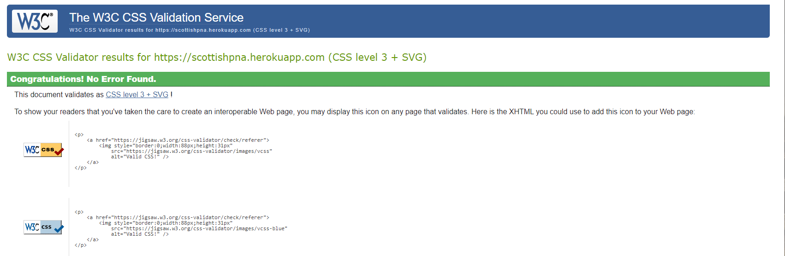
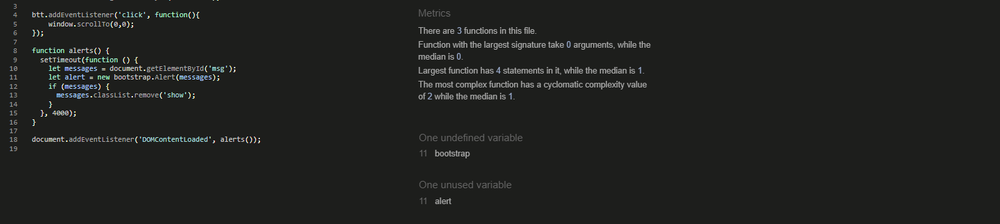

# Testing for SPNA

## Contents

* [Code Validation](<#code-validation>)
* [Automated Testing](<#automated-testing-with-jest-and-unittest>)
* [Responsiveness Test](<#responsiveness-test>)
* [Browser Compatibility](<#browser-compatibility>)
* [Testing User Stories](<#testing-user-stories>)
* [Known Bugs](<#known-bugs>)
* [Additional Testing](<#additional-testing>)

<!-- ToDo - Acceptance criteria for user stories testing,
    - tests themselves.
 -->

## Code Validation
<!-- The Flying Scotsmen has be throughly tested. All the code has been run through the [W3C html validator](https://validator.w3.org/), the [W3C CSS validator](https://jigsaw.w3.org/css-validator/) and the [JavaScript JSHint validator](https://jshint.com/). 
The code passed the W3C Validator barring all the django template tags. Outside of those, no errors were found.
The CSS passed the W3C Validator passed once an error with the 'transition-timing-function' propery was corrected (from '1000ms' to 'ease-in').
After some minor re-formatting the script passed the JSHint tests. There are some warnings about unused variables, however these are related to bootstrap, the googlemaps api and the flatpicker add-on. 

* CSS Validation

* Pep8 Validation for booking/views.py but same result for all custom .py files.

* JSHint results

 -->

[Back to top](<#contents>)
## Automated testing with Jest and Unittest
The automated testing for The SPNA was completed using the Django built in test library Unittest, more specifically the TestCase class. The tests cover forms, models, views and other specific custom functions. Overall test coverage is at 76% for the Python based files. There are a number of lines of code associate with Stripe payments. These haven't been tested with the application as they are verified internally to Stripe.

The automated testing for the Javascript files has been completed with Jest. There are minimal custom function for the SPNA. A number of the functions are Stripe specific and as above they haven't been tested within this application. Overall the tests cover <!--XXXX %?--> of the SPNA javascript files.
<!-- Need to write test for the js in spna_admin -->

* UnitTest for Django
    * UnitTest is built into Django. The documentation is located on the [Django](https://docs.djangoproject.com/en/4.0/topics/testing/overview/#running-tests) website. There is good documentaion for coverage located [here](https://docs.djangoproject.com/en/4.0/internals/contributing/writing-code/unit-tests/#code-coverage).

<!-- 

 -->

* Jest for JavaScript
    * Your application needs to be set up to use Jest for testing. There is good documentation on the [Jest](https://jestjs.io/docs/getting-started) website. 
<!-- 
 -->

[Back to top](<#contents>)
## Responsiveness Test

The responsive design tests were carried out manually with [Google Chrome DevTools](https://developer.chrome.com/docs/devtools/).

|        | Moto G4 | Galaxy S5 | iPhone 5 | iPad | iPad Pro | Display <1200px | Display >1200px |
|--------|---------|-----------|----------|------|----------|-----------------|-----------------|
| Render | pass    | pass      | pass     | pass | pass     | pass            | pass            |
| Images | pass    | pass      | pass     | pass | pass     | pass            | pass            |
| Links  | pass    | pass      | pass     | pass | pass     | pass            | pass            |

[Back to top](<#contents>)
## Browser Compatibility
* The SPNA site has been tested on Chrome, Edge, Safari and Firefox. During development the various webkits were used with the existing CSS to help prevent browser compatability issues.

[Back to top](<#contents>)
## Testing User Stories

* As a **USER** I want to **KNOW MORE ABOUT THE SPNA** so that I can **DETERMINE IF I WANT TO JOIN**.
    - These is information on the *Admin Page* and the *Home page*. If more information is required there is the *Contact form* accessible from any page. 

* As a **USER** I want to **JOIN THE SPNA** so that I can **BENIFIT FROM MEMBER PREVILAGES**.
    - There is a *Join page* with a *Sign Up* form.

* As a **USER** I want to **SEE WHAT NEWS ARITCLES RELATING TO THE SPNA** so that I can **BE MORE INFORMED ABOUT THEIR ACTIVITIES**.
    - The latest news articles related to the SPNA are on the *News page*.

* As a **USER** I want to **KNOW WHAT CAMPAIGNS THE SPNA ARE INVOLVED WITH** so that I can **LEARN AND VIEW THEIR CAUSES**.
    - As well as the *News page* there is also the *Initiatives and Campaigns page, Initiatives section*.

* As a **USER** I want to **KNOW WHAT INITIATIVES THE SPNA ARE RUNNING** so that I can **DO MY PART AND HELP**.
    - As well as the *News page* there is also the *Initiatives and Campaigns page, Campaigns section*.

* As a **USER** I want to **CONTACT THE SPNA** so that I can **DIRECT ANY ENQUIRES APPROPRIATELY**.
    - The *Contact modal* is accessible on every page of the SPNA website.

* As an **ADMIN** I want to **TAKE PAYMENTS** so that I can **BUILD UP A REVENUE STREAM FROM MEMBERS**.
    - There is a payments system setup using *Stripe* payments. It allows the User to select their desired subscription plan.

* As an **ADMIN** I want to **COLLECT MEMBER DETAILS** so that I can **CONTACT THEM REGARDING UPDATES AND NEWS**.
    - The contact details of the members are accessible via the *SPNA Admin page*. There is also a downloadable list of member details in CSV format for ease of cross application use (mail merge, spreadsheets etc).

* As an **ADMIN** I want to **UPDATE THE NEWS ARTICLES** so that I can **KEEP THE WEBSITE NEWS PAGE CURRENT**.
    - On the *SPNA Admin page* there is the ability to add an article. As a superuser the Admin also has access to the *Edit an Article page*. This allows edited articles to be uploaded.

* As an **ADMIN** I want to **UPDATE THE MEMBER DOCUMENTS** so that I can **LET THE MEMBERS KNOW THE LATEST INFORMATION**.
    - On the *SPNA Admin page* there is the ability to upload documents for the members. Documents can be deleted by the Admin on the *Members page* by the means of a button on each document.

* As an **ADMIN** I want to **LINK TO SOCIAL MEDIA SITES** so that I can **INCREASE THE MEMBERSHIP**.
    - There are social links in the *Footer* to the SPNA Facebook business page.

[Back to top](<#contents>)
## Known Bugs
* ### Resolved
    <!-- There were a number of bugs that were overcome during the development process. 
    1. The availability panel on the calendar page. The Calendar in the template tags isn't recognised by the availability section so it was difficult to find the problem and then develop a fix. The fix was to position it absolutley to the page and not the other block elements.

    2. I wanted to add a message to be associated with the new user on the sign-up page. I tried submitting it as a separate form but that wasn't the ideal solution. The fix was to modify the default User class. Then modify the default sign-up form. 

    3. During testing a console error relating to 'Module is not recognised'. After some investigation it was discovered that there were incompatibility issuse with the script.js and the script.jest.js files.
     
    Initially I attemped to remove 'module.exports = {myFunctions}' and replace it with 'export {myFunctions}'. This removed the console error but caused the test file to fail (see next bug!).

    

    4. Now that the module error was removed. The next task was to get the script.test.js file to run and pass all tests. This was a bit more complicated, the problem seems widespread and the fixes seem very dependent on the rest of the code setup. After trying numerous 'fixes' ranging from renaming the .js files to .mjs files to setting up jest.config.js files.
    The ultimate fix in this case was to create a babel.config.js file and to include the following;
     
     

    > // babel.config.js //
        module.exports = {
        presets: [
            [
            '@babel/preset-env',
            {
                targets: {
                node: 'current',
                },
            },
            ],
            ["@babel/preset-react"],
        ],
        };

    The issue seems to stem from the transferring of the common JS into a format readable by ES Modules. Jest/Babel seems to need configuring to accept the ES6 variation of JS.  -->

* ### Unresolved
    <!-- * At the time of writing there is one bug that might detract from the User Experience over the long term. On the Bookings page, currently all the bookings are displayed with the latest being at the top. As the number of bookings increase, the application will continue to display all the existing bookings. This will eventually take up memory and thus time. The most recent bookings are readily visible. For convenience it would be nice to only display the previous 6 months bookings for example. 

    * When the application is viewed in a development environment (In this case, port 8000 with GitPod) the email function will not work. The server fails to connect to the email ports (tried ports 587 and 465). Upon further investigation it appears that GitPod have blocked the access on those ports recently to prevent attacks. The work around to get the tests to run and pass is to assign another EMAIL_BACKEND environmental variable for testing purposes As well as the following code in the views to bypass the sending of email in the development environment.
    
    > if 'runserver' in sys.argv:

    As the email functionality isn't crucial for the application whilst in the development environment this bug will we investigated further after final deployment. 
     
    The error message is below:

     -->

[Back to top](<#contents>)
## Additional Testing
### Lighthouse
The site was also tested using [Google Lighthouse](https://developers.google.com/web/tools/lighthouse) in Chrome Developer Tools to test each of the pages for:
* Performance - How the page performs whilst loading.
* Accessibility - Is the site acccessible for all users and how can it be improved.
* Best Practices - Site conforms to industry best practices.
* SEO - Search engine optimisation. Is the site optimised for search engine result rankings.
<!-- 
Here are the results from The Flying Scotsmen test;

 -->

 
This part of the testing process showed up that the site was slow to load. All the images were compressed and the 'prefetch' function was added to the link elements in the head of the INDEX.page. This sped up the loading time and increased the performance rating.

### Peer review
<!-- The Flying Scotsmen Application has been tested by Peers both in the software development field and external to it. The feedback has generally been positive but with minor points cropping up from time to time. A common one has been 'Server Errors(500)' whilst trying to register or send a contact message. This was found to have been caused by the command to send the email associated with the request. The fix was to change the security settings on the gmail account registered to the application to allow access from low security applications and two factor login and the email side. This poses no problems for the user, it means that the admin of the functional email address would need to complete the extra login steps. -->

Back to [README.md](./README.md#testing).

[Back to top](<#contents>)